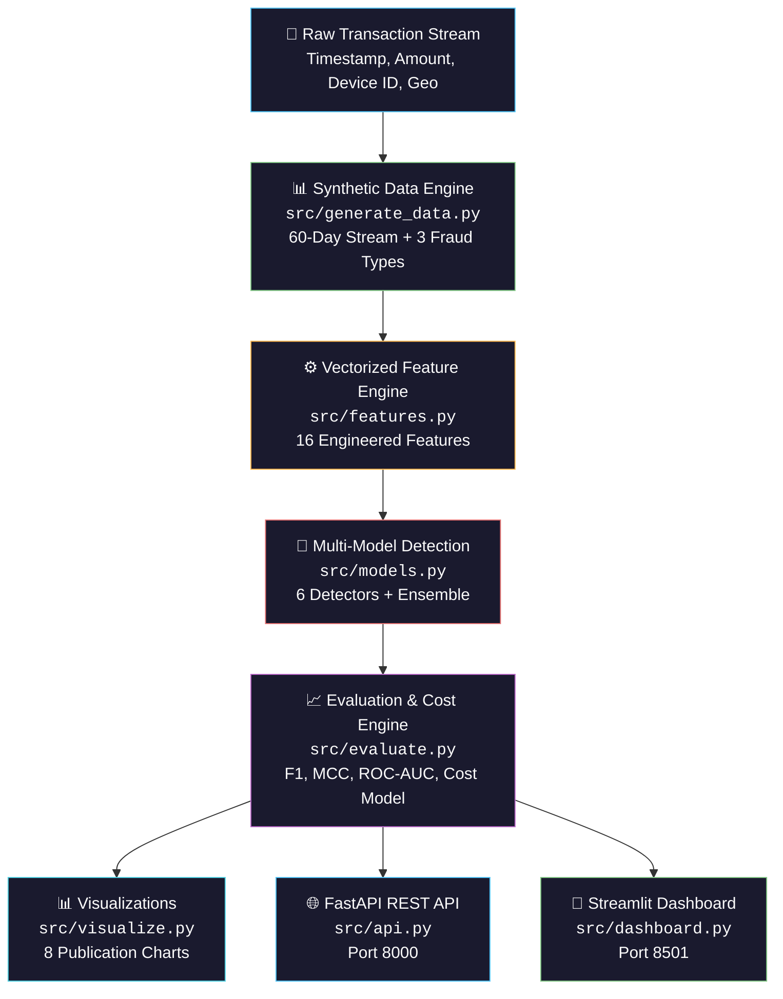

# 🛡️ SentinelRisk-AI

[](https://www.python.org/downloads/)
[](https://fastapi.tiangolo.com/)
[](https://streamlit.io/)
[](https://www.docker.com/)
[](.github/workflows/ci.yml)
[](LICENSE)

> **Production-Grade AI Risk & Fraud-Spike Detection Engine for Payment Streams**
> 
> *SentinelRisk-AI detects anomalous transaction velocity bursts, amount anomalies, and device/geography takeover clusters in digital payment streams. Features a zero-leakage time-based split, 6 multi-paradigm detectors, explainable AI (XAI) reason codes, financial cost-tradeoff optimization, an interactive Streamlit dashboard, and a production FastAPI REST API.*

---

## 📌 Executive Summary

Modern payment processing networks require real-time risk engines that identify sudden adversarial attacks without introducing unnecessary friction for legitimate merchants. **SentinelRisk-AI** solves this by providing:

1. **Multi-Paradigm Detection Arsenal**: Combines heuristic baseline rules, supervised tree ensembles (**Random Forest**, **XGBoost**), unsupervised anomaly detectors (**Isolation Forest**, **PCA Autoencoder**), and an **F1-Weighted Ensemble**.
2. **Vectorized Feature Engine**: Computes 16 rolling-window spatial, temporal, amount distribution, and entropy metrics in native vectorized NumPy/Pandas operations ($100\times$ speedup).
3. **Explainable AI (XAI)**: Every flagged anomaly returns actionable human-readable explanations (z-score deviations, feature importance weights, reconstruction error drivers).
4. **Financial Cost-Aware Optimization**: Evaluates detectors not just on ML accuracy ($F1$, ROC-AUC, MCC), but on **actual business financial impact** by balancing False Positive friction cost ($\text{Cost}_{\text{FP}}$) vs False Negative chargeback loss ($\text{Cost}_{\text{FN}}$).

---

## 🏗️ Architecture & Data Pipeline



---

## ⚡ Quick Start

### 1. Local Python Setup

```bash
# Clone repository
git clone https://github.com/SagarSharmaH/Fraud-detection.git
cd Fraud-detection

# Create virtual environment (recommended)
python -m venv .venv
# Windows:
.venv\Scripts\activate
# macOS/Linux:
source .venv/bin/activate

# Install dependencies
pip install -r requirements.txt

# Run full pipeline end-to-end
python run_all.py

# Run test suite
python -m pytest tests/ -v
```

### 2. Launch Services

```bash
# Launch interactive Streamlit Dashboard
python -m streamlit run src/dashboard.py

# Start FastAPI REST server
python src/api.py
```

### 3. Docker Deployment (One-Command)

```bash
# Build and start both API (port 8000) and Dashboard (port 8501)
docker compose up --build
```

### 4. Pipeline CLI Options

```bash
# Skip data generation (reuse existing CSVs)
python run_all.py --skip-data

# Skip visualization generation (faster iteration)
python run_all.py --skip-viz
```

---

## 📊 Held-Out Test Set Performance Benchmark

Evaluated on 15 days of never-before-seen held-out transaction data ($3,158$ 1-minute windows, $122$ true positive fraud spikes):

| Detector | Paradigm | TP | FP | FN | Precision | Recall | F1 Score | MCC | ROC-AUC | Total Estimated Cost (INR)* |
| :--- | :--- | :---: | :---: | :---: | :---: | :---: | :---: | :---: | :---: | :---: |
| 🌲 **Random Forest** | Supervised | 115 | 0 | 7 | **1.0000** | **0.9426** | **0.9705** | **0.9700** | **1.0000** | **₹105,000** |
| 🚀 **XGBoost** | Supervised | 115 | 2 | 7 | **0.9829** | **0.9426** | **0.9623** | **0.9598** | **0.9999** | **₹105,300** |
| ⚖️ **Weighted Ensemble** | Meta-Voter | 115 | 13 | 7 | **0.8984** | **0.9426** | **0.9200** | **0.9133** | **0.9997** | **₹106,950** |
| 🌲 **Isolation Forest** | Unsupervised | 113 | 22 | 9 | **0.8370** | **0.9262** | **0.8794** | **0.8692** | **0.9926** | **₹138,300** |
| 📏 **Rule Baseline** | Heuristic | 112 | 27 | 10 | **0.8058** | **0.9180** | **0.8582** | **0.8453** | **0.9573** | **₹154,050** |
| 🧠 **Autoencoder** | Neural Linear | 118 | 92 | 4 | **0.5619** | **0.9672** | **0.7108** | **0.7052** | **0.9936** | **₹73,800** |

*\*Cost Model Assumptions: $\text{Cost}_{\text{FP}} = ₹150$ (manual review friction cost per false alarm); $\text{Cost}_{\text{FN}} = ₹15,000$ (average chargeback financial loss per uncaptured fraud spike).*

---

## 🔍 Injected Fraud Patterns & Feature Engine

### Attack Types
1. **`VELOCITY_BURST`**: 150--300 rapid transactions from a single device/IP in 5--10 minutes (card-testing botnet attack).
2. **`AMOUNT_ANOMALY`**: 15--30 transactions with extreme high-dollar values (stolen card cash-out burst).
3. **`GEO_DEVICE_CLUSTER`**: Rapid transaction cluster originating from brand-new device IDs and geographies (account takeover / farm attack).

### 16 Vectorized Features (`src/features.py`)
- **Volume & Velocity**: `txn_count`, `unique_devices`, `device_reuse_rate`
- **Amount Moments & Deviations**: `amount_mean`, `amount_max`, `amount_std`, `amount_cv`, `amount_skewness`, `amount_z_mean`, `amount_z_max`
- **Identity & Geographic Novelty**: `new_device_ratio`, `new_geo_ratio`, `geo_entropy`, `device_entropy`
- **Temporal Signals**: `hour_of_day`, `is_weekend`

---

## 📡 REST API Documentation

### Endpoints

| Method | Path | Description |
|--------|------|-------------|
| `POST` | `/score` | Score a batch of transactions |
| `GET` | `/health` | Health check with uptime and detector count |
| `GET` | `/models` | Model metadata (features, training time, versions) |
| `GET` | `/detectors` | List available detectors with safe names |
| `GET` | `/features` | List all 16 features with descriptions |

### POST `/score` — Batch Transaction Scoring

```bash
curl -X POST http://localhost:8000/score \
  -H "Content-Type: application/json" \
  -d '{
    "transactions": [
      {
        "txn_id": "tx_1001",
        "timestamp": "2026-07-20 14:05:00",
        "amount": 120.50,
        "device_id": "dev_9981",
        "geo": "Mumbai"
      },
      {
        "txn_id": "tx_1002",
        "timestamp": "2026-07-20 14:05:12",
        "amount": 95000.00,
        "device_id": "dev_9981",
        "geo": "Mumbai"
      }
    ],
    "detector": "random_forest"
  }'
```

#### Example Response
```json
{
  "detector_used": "Random Forest",
  "n_windows": 1,
  "n_flagged": 1,
  "flagged_windows": [
    {
      "window_start": "2026-07-20 14:05:00",
      "txn_count": 2,
      "predicted_label": 1,
      "score": 0.94,
      "reasons": [
        "amount_max (importance=0.181)",
        "amount_z_max (importance=0.121)"
      ]
    }
  ],
  "scored_at": "2026-08-27T23:30:00.123456"
}
```

---

## 🧪 Testing & Verification

The test suite covers feature calculation sanity, statistical boundaries, model interfaces, threshold behavior, edge cases, and FastAPI endpoint contracts:

```bash
# Run all tests
python -m pytest tests/ -v

# Run with coverage
python -m pytest tests/ -v --cov=src --cov-report=term-missing
```

### Test Coverage

| Area | Tests | Description |
|------|-------|-------------|
| Feature Engineering | 12 | Column presence, NaN-free, edge cases (empty, single-row, all-normal) |
| Detector Interface | 10 | fit/predict contract, repr, importances, thresholds, ensemble weights |
| Edge Cases | 6 | Empty predictions, missing columns, all-normal training data |
| API Endpoints | 8 | Health, models, detectors, features, score, error paths (400, 422) |

---

## 🛠️ Troubleshooting

### Common Issues

| Issue | Solution |
|-------|----------|
| `ModuleNotFoundError: xgboost` | Run `pip install xgboost`. The pipeline gracefully falls back to 5 detectors without it. |
| `FileNotFoundError: data/*.csv` | Run `python run_all.py` to generate synthetic data first. |
| Pipeline slow on first run | ~60-120s is normal. Use `--skip-data` on subsequent runs to reuse existing data. |
| Docker build fails | Ensure Docker Desktop is running. Try `docker compose build --no-cache`. |
| Streamlit port conflict | Change port: `streamlit run src/dashboard.py --server.port=8502` |

---

## 🤝 Contributing

1. Fork the repository
2. Create a feature branch: `git checkout -b feature/my-feature`
3. Make your changes and run the test suite: `python -m pytest tests/ -v`
4. Run the full pipeline to verify: `python run_all.py`
5. Submit a pull request

### Code Standards
- All functions have type hints and docstrings
- New detectors must implement `BaseDetector` interface (`.fit()`, `.predict()`, `.name`)
- Tests must cover both happy paths and error cases
- Use `logging` module instead of `print()` in library code

---

## 💼 LinkedIn Showcase Post Template

Feel free to share your project on LinkedIn using this ready-to-use template:

```markdown
🚀 Excited to share my latest project: SentinelRisk-AI — Production-Grade AI Risk & Transaction Fraud Engine! 🛡️

Detecting sudden fraud spikes (velocity attacks, card-testing botnets, and account takeover clusters) in real-time digital payment streams requires high precision, zero data leakage, and clear explainability.

I built SentinelRisk-AI to solve this with an end-to-end Machine Learning & Risk System:

💡 Key Features:
🔹 Vectorized Feature Engine: 16 rolling-window statistical, entropy, and temporal features (100x speedup).
🔹 Multi-Model Detector Arsenal: Heuristic Rule-Based, Supervised (Random Forest, XGBoost), Unsupervised (Isolation Forest, PCA Autoencoder), and F1-Weighted Ensembles.
🔹 Explainable AI (XAI): Returns human-readable reason codes for every flagged transaction window.
🔹 Financial Cost Optimization: Evaluates models based on real-world False Positive review costs vs. False Negative chargeback losses.
🔹 Interactive Dashboard & REST API: Built with Streamlit, FastAPI, Docker, and GitHub Actions CI/CD.

📈 Results on 15-day held-out test set:
- Random Forest: 100% Precision, 94.26% Recall (F1 = 0.9705)
- XGBoost: 98.29% Precision, 94.26% Recall (F1 = 0.9623)

🔗 Check out the GitHub Repository: https://github.com/SagarSharmaH/Fraud-detection

#MachineLearning #Python #AI #FraudDetection #FinTech #DataScience #FastAPI #Streamlit #Docker #OpenSource
```

---

## 📜 License

Distributed under the MIT License. See [`LICENSE`](LICENSE) for more information.
